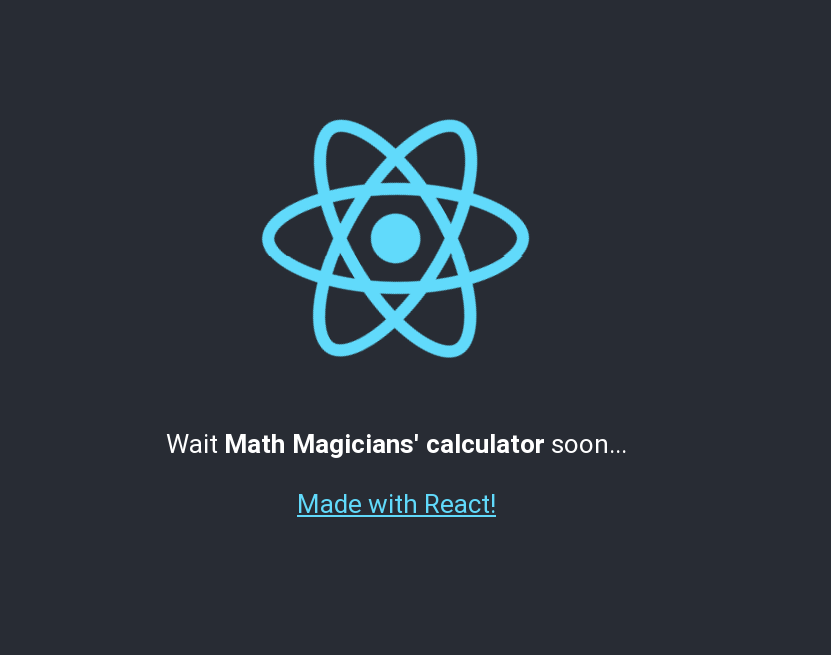
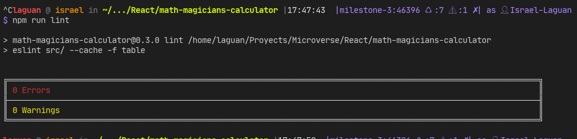
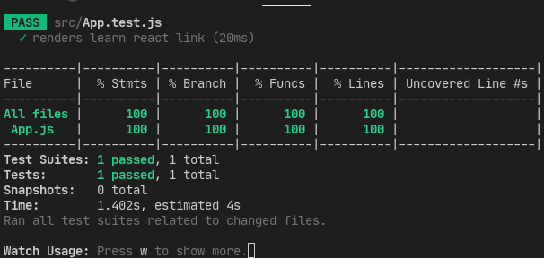

<!-- PROJECT SHIELDS -->
<!--
*** "reference style" links are used for readability.
*** Reference links are enclosed in brackets [ ] instead of parentheses ( ).
*** See the bottom of this document for the declaration of the reference variables
*** for contributors-url, forks-url, etc. This is an optional, concise syntax you may use.
*** https://www.markdownguide.org/basic-syntax/#reference-style-links
-->

[![Contributors][contributors-shield]][contributors-url]
[![Forks][forks-shield]][forks-url]
[![Stargazers][stars-shield]][stars-url]
[![Issues-open][issues-open-shield]][issues-open-url]
[![Issues-closed][issues-closed-shield]][issues-closed-url]

<!-- PROJECT LOGO -->
 

  

  <h1 align="center">
	Math Magicians Calculator
  </h1>

  

    A fully-functional, but also beautiful and user-friendly calculator app
     
	  🖊️
    <a href="https://github.com/microverseinc/project-react-calculator/blob/master/README.md">Assignment</a>
    🐞
    <a href="https://github.com/Israel-Laguan/MathMagicians-Calculator/issues">Report a Bug</a>
    🙋‍♂️
    <a href="https://github.com/Israel-Laguan/MathMagicians-Calculator/issues">Request Feature</a>
  

## Milestone 2

Now, it is time to start with the real coding by defining the basic React components which will compose your whole calculator.

[Requirements](https://github.com/microverseinc/project-react-calculator/blob/master/milestones/MILESTONE_2.md)

# Specifications

## The Project

Math-magicians is a fictional company based in France. They have requested your help to build a simple product that would assist them with their calculations. An important thing to notice is that they have asked for a product that is not just fully-functional, but also beautiful and user-friendly.

- Linters
- React
- React-DOM
- React-Create-App
- ES6 syntax
- Export/import ES6+ notation

# Features

- Basic `create-react-app` structure
- Sets `stickler` on the repo
- Sets `eslint` rules
- Tests made with [`ESLint`](https://eslint.org/)
- Unit Testing with [`Jest`](https://jestjs.io/)
- Add `jest` and `eslint` to be callable with `npm`

# Tests

## `ESlint`

## `Jest`

# Built With

- `create-react-app`
- `ESLint`
- `npm`
- `vscode` with _ESLint_ extension
- Linux/GNU
- Love and Passion for code

# Live Demo

[Link](https://math-magicians-calculator.herokuapp.com/)

# Authors

👨 [Israel Laguan](https://github.com/Israel-Laguan)

# 🤝 Contributing

Contributions, issues and feature requests are welcome!

# 🤗 Show your support

Give a ⭐️ if you like this project!

# 🏅 Acknowledgements

Give a ⭐️ if you like this project!

- [Microverse](https://www.microverse.org/)
- [The Odin Project](https://www.theodinproject.com/)

# 📝 License

This project is licensed under the [MIT](LICENSE)\
Feel free to fork this project and improve it

<!-- MARKDOWN LINKS & IMAGES -->
<!-- https://www.markdownguide.org/basic-syntax/#reference-style-links -->

[contributors-shield]: https://img.shields.io/github/contributors/Israel-Laguan/MathMagicians-Calculator?style=plastic
[contributors-url]: https://github.com/Israel-Laguan/MathMagicians-Calculator/graphs/contributors
[forks-shield]: https://img.shields.io/github/forks/Israel-Laguan/MathMagicians-Calculator?style=plastic
[forks-url]: https://github.com/Israel-Laguan/MathMagicians-Calculator/network/members
[stars-shield]: https://img.shields.io/github/stars/Israel-Laguan/MathMagicians-Calculator?style=plastic
[stars-url]: https://github.com/Israel-Laguan/MathMagicians-Calculator/stargazers
[issues-open-shield]: https://img.shields.io/github/issues/Israel-Laguan/MathMagicians-Calculator?style=plastic
[issues-closed-url]: https://github.com/Israel-Laguan/MathMagicians-Calculator/issues
[issues-closed-shield]: https://img.shields.io/github/issues-closed/Israel-Laguan/MathMagicians-Calculator?style=plastic
[issues-open-url]: https://github.com/Israel-Laguan/MathMagicians-Calculator/issues
